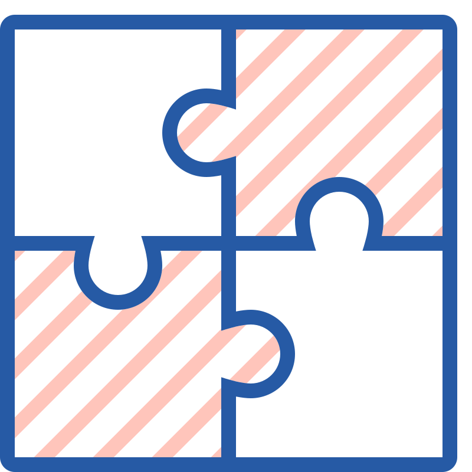

<h1 align="center">
  
</h1>

<h5 align="center">
  <code><a href="https://www.linkedin.com/in/sebahattindemir" title="LinkedIn Profile"> LinkedIn</a></code>
  <code><a href="https://www.codewars.com/users/sebo07" title="Codewars Profile"> Codewars</a></code>
</h5>
 

  Hi, I'm Sebahatin Demir, QA Automation Test Engineer from Turkey
   
   
  🔬 I'm currently studying for 
   
  🎓 I graduated from 
   
  🎓 I graduated from 
   
  💻 I love writing code and learn anythings about it
   
  📚 I’m currently learning how to build 
   
  💬 Ask me anything about from <a href="https://www.linkedin.com/in/sebahattindemir" title="Issues">Here</a>
   
  📫 How to reach me: <a href="mailto: info.sebahattindemir@gmail.com">info.sebahattindemir@gmail.com</a>

<h2 align="center">🔥 Languages & Frameworks & Tools & Abilities 🔥</h2>
 

  <code></code>
  <code></code>
  <code></code>
  <code></code>
  <code></code>
  

  
  

  <code></code>
  <code></code>
  <code></code> 
  <code></code>
  <code></code> 

<h2 align="center">⚡ Stats ⚡</h2>
 

  

    
    
  

           

   
  
  

<h2 align="center">👨‍💻 Repositories 👨‍💻</h2>
 

  
  

      

  
  

      

  
  

      

<!--

  
  

-->

      

<h4 align="center">
  <a href="https://github.com/SebahattinDemir?tab=repositories" title="Show Repositories">🔎 Show More 🔍</a>
</h4>

<!--

Here are some ideas to get you started:

- 🔭 I’m currently working on ...
- 🌱 I’m currently learning ...
- 👯 I’m looking to collaborate on ...
- 🤔 I’m looking for help with ...
- 💬 Ask me about ...
- 📫 How to reach me: ...
- 😄 Pronouns: ...
- ⚡ Fun fact: ...

-->
